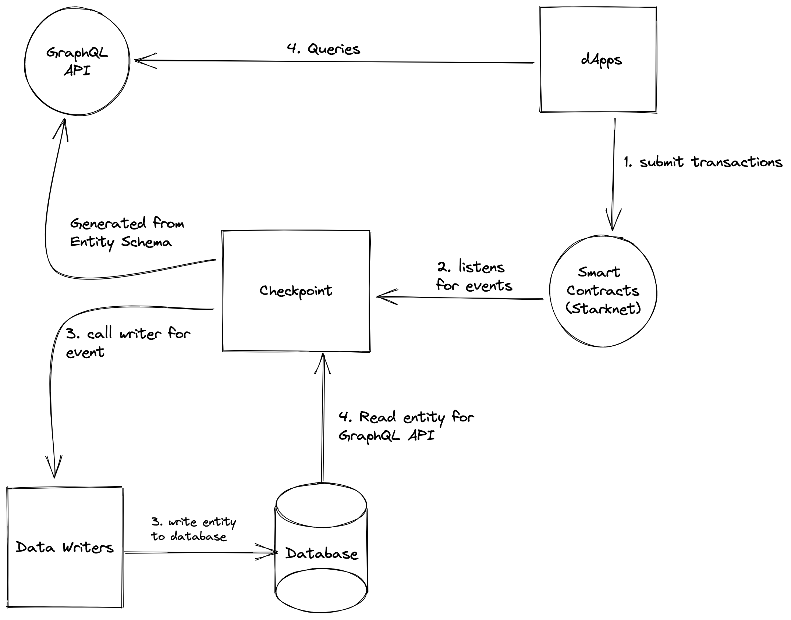

# Introduction

Checkpoint is a library for indexing data from StarkNet events and making it accessible through GraphQL. Checkpoint is inspired by The Graph and focused on providing similar functionality for StarkNet.

## How it works

Checkpoint learns what and how to index StarkNet data based on some configuration parameters, known as the [Checkpoint configuration](core-concepts/checkpoint-configuration.md). The Checkpoint configuration defines the smart contracts of interest and the events in those contracts to pay attention to. The logic for how to map event data to data that Checkpoint will store in its database is defined in user-defined functions called [Checkpoint data writers](core-concepts/checkpoint-writers.md).

This diagram gives more detail about the flow of data once a Checkpoint instance has started processing StarkNet transactions:



As highlighted in the flow diagram above:

1. A decentralized application adds data to StarkNet through a transaction on a smart contract.
2. The smart contract emits one or more events while processing the transaction. Checkpoint continually scans StarkNet for new blocks and checks if it contains events for your configured contracts they may contain.
3. Checkpoint calls the data writer function for the respective event. [Writers](core-concepts/checkpoint-writers.md) are responsible for writing entity objects to the database.
4. The decentralized application queries the Checkpoint GraphQL API. Checkpoint translates the GraphQL queries into SQL queries to fetch this entity data from the database. The decentralized application displays this data in a rich UI for end-users, which they can also use to issue new transactions on StarkNet, and the cycle repeats.

## Installation

Checkpoint is an NPM package that can be installed through the following command:

```bash
npm install @snaphsot-labs/checkpoint
```

## Guides: Jump right in

Follow our handy guides to get started with Checkpoint as quickly as possible:


[quickstart.md](guides/quickstart.md)



[advanced-options.md](guides/advanced-options.md)


## Core Concepts: Dive a little deeper

Learn the fundamentals of Checkpoint to get a deeper understanding of how it works:


[checkpoint-configuration.md](core-concepts/checkpoint-configuration.md)



[entity-schema.md](core-concepts/entity-schema.md)



[checkpoint-writers.md](core-concepts/checkpoint-writers.md)

